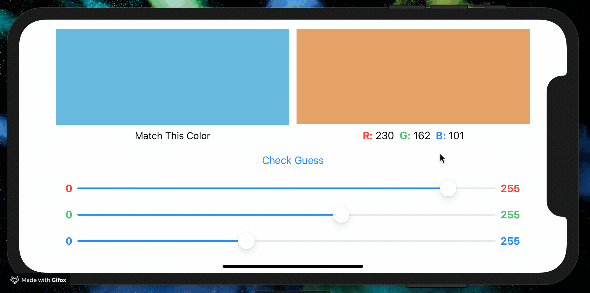

# SwiftUI By Tutorials

_Projects, playgrounds, and other materials made while following along with the Ray Wenderlich book ["SwiftUI By Tutorials"](https://store.raywenderlich.com/products/swiftui-by-tutorials)._

 
 

# Contents

- [Chapter 2: Getting Started](./02-getting-started)
    - Building a slider-based RGB color guessing game
    

- [Chapter 3: Understanding SwiftUI](./03-understanding-swiftui)
    - Declarative app development and the tools offered by SwiftUI to facilitate it.

- [Chapter 4: Integrating SwiftUI](./04-integrating-swiftui)
    - Wrapping SwiftUI views in UIKit views
    - Wrapping UIKit views in SwiftUI views
    - Using `Coordinator`s inside of `UIViewRepresentable` types to store data bound across SwiftUI and UIKit.

- [Chapter 5: The Apple Ecosystem](./05-the-apple-ecosystem)
    - Building Swift Packages and Sharing Functionality Across Projects
    - Using SwiftUI across iOS, macOS, and tvOS.

- [Chapter 6: Intro to Controls: Text & Image](./06-intro-to-controls-text-and-image)

- [Chapter 7: State & Data Flow](./07-state-and-data-flow)

- [Chapter 8: Controls & User Input](./08-controls-and-user-input)

- [Chapter 9: Stacks & Containers](./09-stacks-and-containers)

- [Chapter 10: Lists & Navigation](./10-lists-and-navigation)

- [Chapter 11: Building for Testability](./11-building-for-testability)

- [Chapter 12: Handling User Input](./12-handling-user-input)

- [Chapter 13: Drawing & Custom Graphics](./13-drawing-and-custom-graphics)

- [Chapter 14: Animations](./14-animations)

- [Chapter 15: Complex Interfaces](./15-complex-interfaces)

# Projects

- (Quite a few... but documenting is in progress 🙂)
